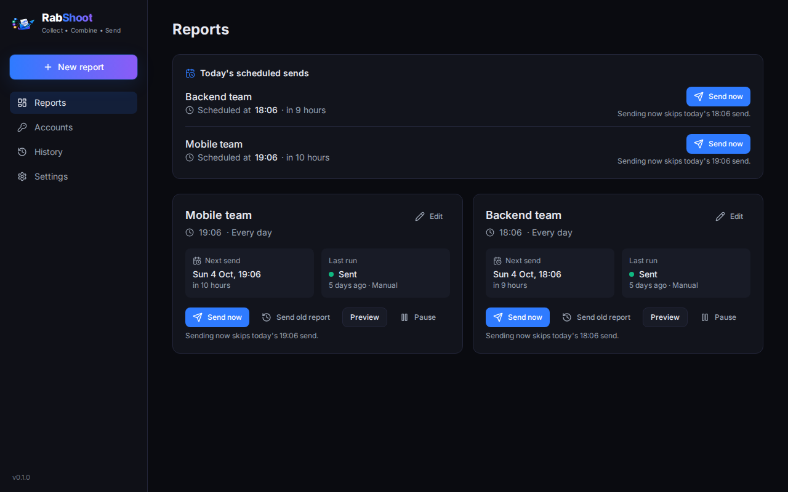
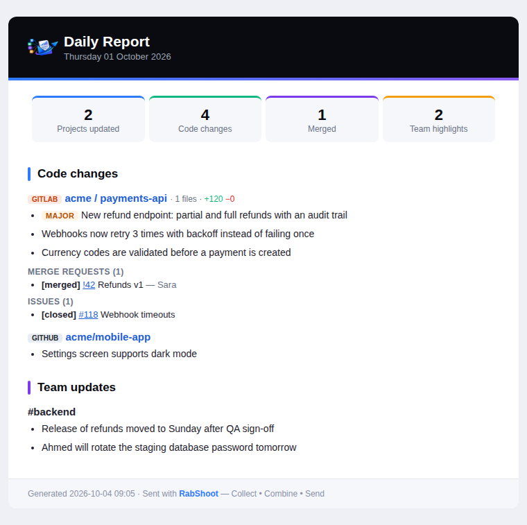
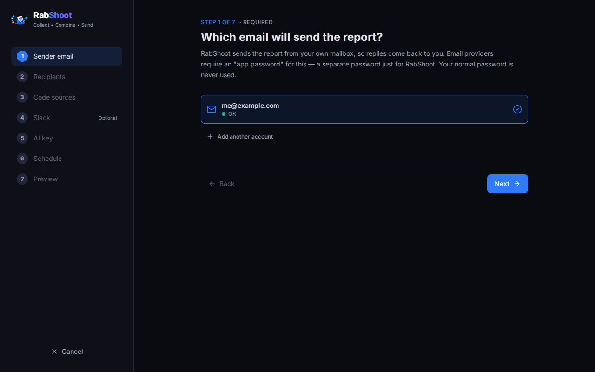
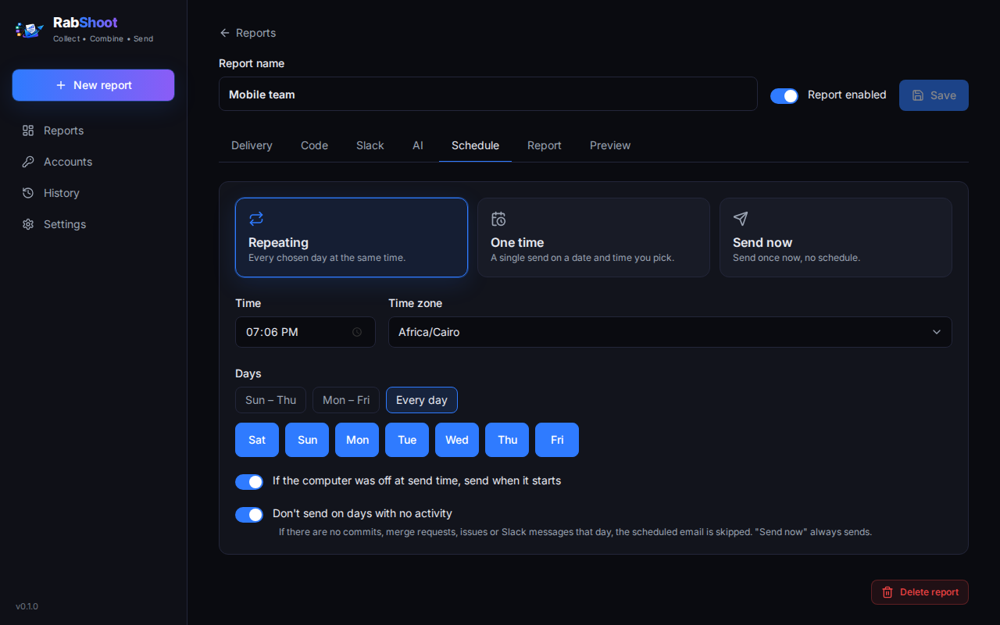
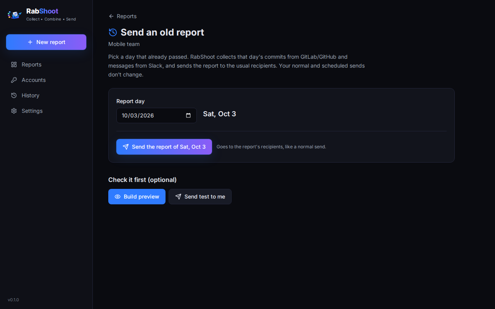
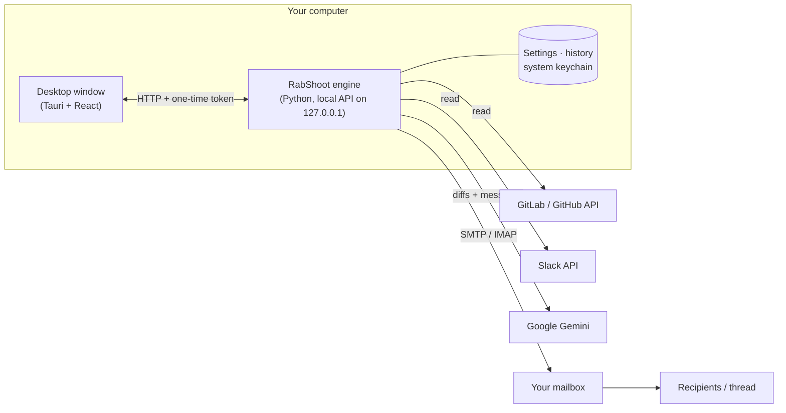

<p align="center">
  
</p>

<h1 align="center">RabShoot</h1>

<p align="center">
  <b>Collect • Combine • Send</b><br>
  A desktop app that writes your daily work report for you: it reads the day's commits from
  GitLab / GitHub and the work talk from Slack, summarizes it with AI, and emails it on your schedule.
</p>

<p align="center">
  <a href="https://github.com/A7my/rabshoot/releases/latest/download/RabShoot-windows-x64-setup.exe"><b>⬇ Download for Windows</b></a>
  &nbsp;·&nbsp;
  <a href="https://github.com/A7my/rabshoot/releases/latest/download/RabShoot-linux-amd64.deb"><b>⬇ Download for Linux (.deb)</b></a>
  &nbsp;·&nbsp;
  <a href="https://github.com/A7my/rabshoot/releases">All versions</a>
</p>

<p align="center">
  
</p>

---

## What is it?

Writing a daily report means digging through commits, merge requests and chat history at the end of
a tiring day. RabShoot does that part. It runs quietly in the system tray and, at the time you choose:

1. **Collects** what happened that day: commits, merge/pull requests and issues from **GitLab** and
   **GitHub**, and messages from the **Slack** channels and chats you pick (greetings and small talk
   are ignored).
2. **Combines** it with AI (Google Gemini): the real code changes are read and explained in plain
   English, and Slack threads are reduced to decisions and next steps.
3. **Sends** a clean, branded email from your own mailbox, either to the people you choose or as a
   reply-all in an existing email thread (for example the team's "Daily updates" thread).

Everything runs on your computer. There is no RabShoot server and no account to create.

<p align="center">
  
  <br><sub>An example report (made-up data)</sub>
</p>

## Download and install

| System | File | Install |
|---|---|---|
| **Windows 10 / 11** (64-bit) | [RabShoot-windows-x64-setup.exe](https://github.com/A7my/rabshoot/releases/latest/download/RabShoot-windows-x64-setup.exe) | Run the file. If Windows shows "Windows protected your PC", click **More info → Run anyway** (the app is not code-signed yet). |
| **Linux**: Ubuntu 22.04+, Debian 12+, Linux Mint 21+, Pop!_OS 22.04+ (64-bit) | [RabShoot-linux-amd64.deb](https://github.com/A7my/rabshoot/releases/latest/download/RabShoot-linux-amd64.deb) | In a terminal in the download folder: `sudo apt install ./RabShoot-linux-amd64.deb` |

Then open **RabShoot** from the Start menu / apps menu. It starts with your computer and lives in
the tray; closing the window does not stop the reports (use **Quit** in the tray menu for that).

- Uninstall on Linux: `sudo apt remove rab-shoot`. On Windows: *Settings → Apps → RabShoot*.
- On GNOME (default Ubuntu), the tray icon needs the "AppIndicator" extension.
- Passwords and tokens are stored in the system keychain (Windows Credential Manager, GNOME Keyring
  or KWallet).

## How to use it

The first start opens a short setup (about 5 minutes, every step explains where to click):

<p align="center"></p>

| Step | What you give it |
|---|---|
| 1. Sender email | The mailbox that sends the report (Gmail, Outlook, Yahoo, iCloud, Zoho or any IMAP/SMTP), with an *app password* |
| 2. Recipients | Specific people (To / CC / BCC), **or** "reply in a thread": pick an existing email thread and reply-all |
| 3. Code sources | GitLab and/or GitHub accounts; all projects with activity or selected ones; optionally "only these authors" |
| 4. Slack *(optional)* | Your workspace and the channels / chats to read |
| 5. AI key | A free Google Gemini key (link and steps included) |
| 6. Schedule | **Repeating** (time + days), **one time** (date + time), or **send now** (no schedule) |
| 7. Preview | See the exact email before anything is sent, or send a test to yourself |

After that, the **Reports** page shows each report with its next send, the last result, and buttons:

- **Send now**: send today's report immediately. Today's scheduled send is then skipped, so nobody
  gets it twice.
- **Send old report**: opens a separate page where you pick a day that already passed and send the
  report for that day (with an optional preview first).
- **Preview**, **Pause / Resume**, and **Edit**. Edit has tabs for delivery, code, Slack, AI,
  schedule, look and preview.

<p align="center">
  
  &nbsp;
  
</p>

Good to know:

- **Live progress** while a report is built: code → Slack → AI → email, with the current project.
- **Quiet days**: if there are no commits, merge requests, issues or Slack messages that day, the
  scheduled email is skipped (can be turned off). A broken token is reported as a failure, not as a
  quiet day.
- **Computer was off?** A missed send goes out when the computer starts (can be turned off).
- **Several reports**: e.g. one per team, each with its own sender, recipients, sources and time.
- **History** keeps every run with the exact email that was sent; failed runs can be re-sent.
- **English and Arabic** interface (right-to-left supported).

Full guide: [English](docs/user-guide.md) · [Arabic](docs/user-guide.ar.md)

## How it works



- The **desktop window** is a [Tauri](https://tauri.app) app (Rust shell + React UI). It starts the
  engine as a background process, shows the tray icon, starts with the computer and keeps a single
  instance.
- The **engine** (`engine/rabshoot_engine`) does the real work. It talks to the window through a
  local API that only accepts connections from this computer, protected by a random token that
  changes on every start. Its scheduler (APScheduler) runs one job per report.
- **A report run**: collect the day's activity for the report's time zone → send code diffs and Slack
  threads to the AI in small batches → render the branded HTML + plain-text email → send it through
  your mailbox's SMTP server. For a thread reply, it first finds the thread over IMAP so the reply
  lands in the same conversation with everyone on it.
- **Storage**: settings are JSON files and history is SQLite, in `~/.config/rabshoot` and
  `~/.local/share/rabshoot` on Linux or `%APPDATA%\RabShoot` on Windows. Tokens and passwords are in
  the system keychain.

## Privacy

RabShoot only **reads** from GitLab, GitHub and Slack; it never changes code or posts messages. The
only data that leaves your computer goes to those services, to the AI provider (code changes and
selected Slack messages, to be summarized), and to your mailbox. `.env` files, keys and lock files are
never sent to the AI, and secret-looking values in diffs are masked. Free AI tiers may use the data to
improve their models; read [docs/privacy.md](docs/privacy.md) before using a free key with company code.

---

## For developers

| Path | What |
|---|---|
| `engine/` | Python engine `rabshoot_engine`: sources, AI, email, scheduler, SQLite history, local API (FastAPI) |
| `app/` | React + TypeScript + Tailwind UI (Vite) |
| `app/src-tauri/` | Tauri 2 shell (Rust): starts the engine sidecar, tray, autostart, single instance, notifications |
| `packaging/` | PyInstaller spec for the engine sidecar, Docker build for the Linux `.deb` |
| `scripts/` | Engine build, Linux `.deb` build, icons, screenshots, dev helpers |
| `daily_report/` | The original command-line prototype (`cp config.example.yaml config.yaml` to try it) |

### Run it locally

Requirements: Python 3.11+, Node 20+, and for the desktop shell Rust stable plus the
[Tauri system libraries](https://tauri.app/start/prerequisites/).

```bash
# engine + tests
python -m venv .venv && .venv/bin/pip install -e "engine[dev]"
cd engine && ../.venv/bin/python -m pytest -q && cd ..

# UI in a browser against a dev engine (no Rust needed)
RABSHOOT_HOME=$PWD/.rabshoot-dev RABSHOOT_SECRETS=file PYTHONPATH=engine \
  .venv/bin/python -m rabshoot_engine serve --port 8765 --token dev --no-catch-up
cd app && npm ci && npm run dev      # http://localhost:1420  (add ?lang=ar for Arabic)
```

Engine CLI:

```bash
python -m rabshoot_engine list                         # accounts and reports
python -m rabshoot_engine run "<report>" --dry-run     # build a report, save rabshoot-preview.html, send nothing
```

| Variable | Meaning |
|---|---|
| `RABSHOOT_HOME` | Keep config and data in one folder |
| `RABSHOOT_SECRETS=file` | Store secrets in a private file instead of the system keychain |
| `RABSHOOT_GITHUB_CLIENT_ID`, `RABSHOOT_GITHUB_APP_SLUG` | GitHub App for one-click GitHub sign-in (Device Flow) |
| `RABSHOOT_GITLAB_CLIENT_ID` | GitLab.com OAuth app (redirect `http://127.0.0.1:47113/callback`, scopes `read_api read_user`) |

Without the OAuth ids the app still works: it guides users to create a personal access token.

### Build the installers

```bash
python scripts/build_engine.py      # engine sidecar -> app/src-tauri/binaries/
cd app && npx tauri build           # Windows: NSIS .exe · Linux: .deb + .AppImage
```

A Linux build only runs on the distro version it was built on or newer (glibc). For a `.deb` that
runs on Ubuntu 22.04+ / Debian 12+, build it in Docker: `scripts/build_linux_deb.sh`, which writes
`release/RabShoot_<version>_amd64.deb`.

### Publish a release

GitHub Actions (`.github/workflows/build.yml`) tests the engine and builds the Windows and Linux
installers on every push. To publish a version:

```bash
git tag v0.1.0 && git push origin v0.1.0
```

The workflow creates the GitHub release and attaches the installers under fixed names
(`RabShoot-windows-x64-setup.exe`, `RabShoot-linux-amd64.deb`), so the download links at the top of
this page always point to the newest version.
